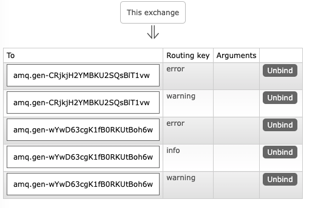

## 路由
### 绑定

### 直连交换器
通过routing key进行过滤匹配，分发到相应的队列

### 多重绑定
在交换器为direct的情况下实现类似全局广播的行为

### 发送日志


### 订阅


### 完整示例
1、启动两个receive终端：
第一个终端执行，绑定了三个Routing Key：info、warning、error（接收全部类型的消息）
```
go run receive_logs_direct.go info warning error
```
第二个终端执行，绑定了两个Routing key：warning、error（只接收warning和error类消息）
```
go run receive_logs_direct.go warning error > logs_from_rabbit.log
```

2、启动send终端
第一条消息发送绑定的routing key为 error（结果receive端都收到了消息）
```
go run emit_log_direct.go error "Run. Run. Or it will explode."
```
第二条消息绑定的routing key为 hello（结果receive端没有收到消息）
```
go run emit_log_direct.go hello "Run. Run. Or it will explode."
```

3、查看RabbitMQ终端，发现启动的两个receive终端的2个exchange交换器总共绑定了5个Routing key：
