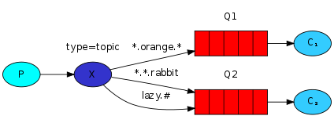

## Topic（主题交换器）
发送到topic交换器的消息不能具有随意的routing_key——它必须是单词列表，以点分隔。这些词可以是任何东西，但通常它们指定与消息相关的某些功能。一些有效的routing_key示例：“stock.usd.nyse”，“nyse.vmw”，“quick.orange.rabbit”。routing_key中可以包含任意多个单词，最多255个字节。

绑定键也必须采用相同的形式。topic交换器背后的逻辑类似于direct交换器——用特定路由键发送的消息将传递到所有匹配绑定键绑定的队列。但是，绑定键有两个重要的特殊情况： - *（星号）可以代替一个单词。 - ＃（井号）可以替代零个或多个单词。

通过下面这个示例可以很容易看明白这一点：



## 完整示例
我们将在日志记录系统中使用topic交换器。我们将从一个可行的假设开始，即日志的路由键将包含两个词："facility.severity"。

日志接收端：
1、想要接收所有的日志：
```
go run receive_logs_topic.go "#"
```

2、要从“kern”接收所有日志：
```
go run receive_logs_topic.go "kern.*"
```

3、或者，如果你只想接收“critical”日志：
```
go run receive_logs_topic.go "*.critical"
```

4、你可以创建多个绑定：
```
go run receive_logs_topic.go "kern.*" "*.critical"
```

日志发送端：
1、并发出带有路由键“kern.critical”的日志：
```
go run emit_log_topic.go "kern.critical" "A critical kernel error"
```

## 文章
- https://www.liwenzhou.com/posts/Go/rabbitmq-5/
